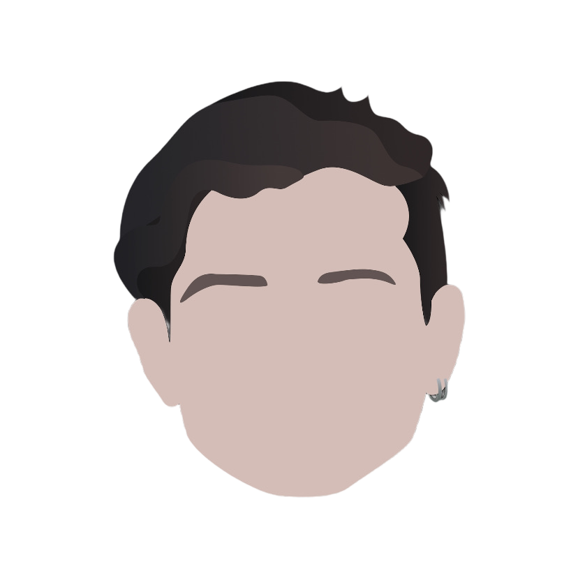

# Hey there, I'm Nicolás Massardo 

<h4> I'm a developer and student </h4>

- 🚀 I'm currently working as a Software Engineering II @ [Toku](https://trytoku.com/)
- ✏️ I write a [newsletter](https://nicomassardo.substack.com/)
- 🤓 I studied engineering at Pontificia Universidad Católica de Chile
- 👨🏻‍💻 Personal projects:
  - [Eligebien2021](https://eligebien.herokuapp.com/)
  - A beerpong tournament web app
- 💻 I have collaborated in:
  - [Fig (YC S20)](https://github.com/withfig/autocomplete)
  - [Plutto’s python SDK](https://github.com/plutto-labs/plutto-python)
  - [Fintoc’s python SDK](https://github.com/fintoc-com/fintoc-python)
- I have wrote _Explained_ kind of posts about:
  - [Open Source](https://plata.news/blog/que-es-open-source/)
  - [Github Copilot](https://plata.news/blog/github-copilot-explained/)
- 🔭 I've worked on the teaching assistantships of:
  - Detailed Software Design
  - Introduction to Programming
  - Introduction to Economics
- 😄 I’m looking to collaborate on projects and Open Source
- ⚡ A useful shortcut cheatsheet: https://usethekeyboard.com/

## Skills 

 

Please feel free to clone/fork projects, raise issues and submit PRs if you think something could be better or you want to collaborate with me.  
Ask me anything <a href="https://github.com/nmassardot/nmassardot/issues/new"><b>here</b></a>
 

<h2> Connect with me</h2>

 

Last Edited on: 15/06/2022
